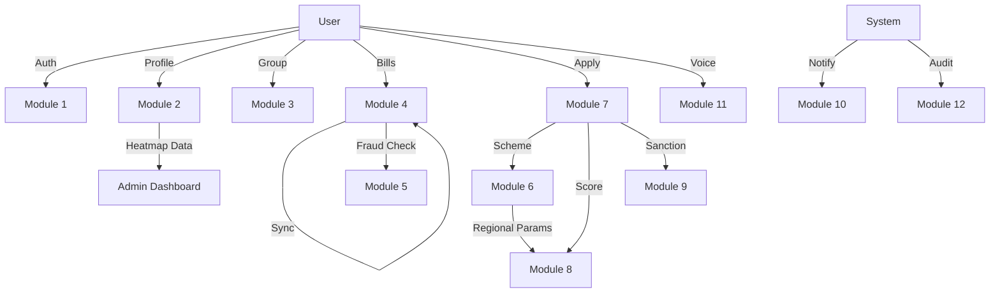

# Master System Documentation (Final)

## 1. System Overview
The **Income Processing & Scoring System** is a modular, microservice-ready monolithic backend designed to facilitate digital lending for low-income beneficiaries. It leverages alternative data (consumption patterns, group behavior) to assess creditworthiness and automate loan sanctioning.

## 2. High-Level Architecture
The system is built on **Spring Boot** with **PostgreSQL** as the primary datastore.

### Core Components
- **API Gateway Layer**: Handles authentication, rate limiting, and routing.
- **Core Modules**: 12 distinct modules handling specific business domains.
- **Analytics Engine**: Powers Community Heatmaps and Demographic Stats (Module 2).
- **Fail-Safe System**: Feature Flags (Module 1) allow graceful degradation when ML/Voice services are down.

## 3. Module Interaction Diagram

## 4. Global Business Rules
1. **Fail-Safe Design**: Critical flows must work even if auxiliary services are down.
2. **Data Consistency**: ACID compliance for financial transactions.
3. **Auditability**: Immutable logs for 7 years.
4. **Regional Logic**: All scoring must account for configured Regional Cost Parameters.

## 5. Non-Functional Requirements
- **Performance**: API response < 200ms.
- **Scalability**: 1M+ users.
- **Offline Support**: Sync APIs for PWA.

## 6. Technology Stack
- **Backend**: Java 17+, Spring Boot 3.x
- **Database**: PostgreSQL 15+
- **Auth**: Keycloak
- **Storage**: S3
