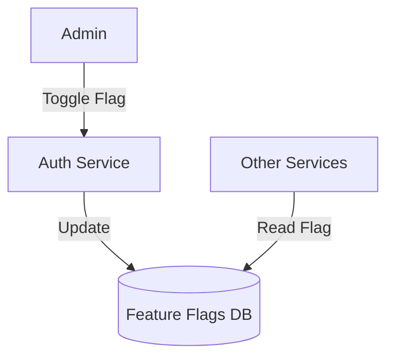

# Module 1: Auth & User Management

## 1. Module Overview
This module handles user registration, authentication, role management, and profile updates. It integrates with Keycloak for identity management and ensures secure access to the system. It also manages password resets, user status, and **System-wide Feature Flags**.

## 2. Inputs & Outputs
- **Inputs**: User credentials, OTP, Profile updates, Feature Flag toggles.
- **Outputs**: JWT Tokens, User Profile, System Config Status.

## 3. Tables Used
- `users`
- `feature_flags`

## 4. Detailed API List
| Method | Endpoint | Description | Request Body | Response Body |
| :--- | :--- | :--- | :--- | :--- |
| POST | `/auth/register` | Register new user | `RegisterRequest` | `AuthResponse` |
| POST | `/auth/login` | Login | `LoginRequest` | `AuthResponse` |
| POST | `/auth/refresh-token` | Refresh token | `RefreshTokenRequest` | `AuthResponse` |
| POST | `/auth/logout` | Logout | - | `StatusResponse` |
| POST | `/auth/forgot-password` | Forgot password | `ForgotPasswordRequest` | `StatusResponse` |
| POST | `/auth/reset-password` | Reset password | `ResetPasswordRequest` | `StatusResponse` |
| GET | `/users/me` | Get profile | - | `UserProfileResponse` |
| PUT | `/users/me` | Update profile | `UpdateUserRequest` | `UserProfileResponse` |
| PUT | `/users/me/change-password` | Change password | `ChangePasswordRequest` | `StatusResponse` |
| GET | `/users` | List users (Admin) | - | `UserListResponse` |
| GET | `/users/{id}` | Get user (Admin) | - | `UserProfileResponse` |
| PUT | `/users/{id}/status` | Update status | `StatusUpdateRequest` | `StatusResponse` |
| DELETE | `/users/{id}` | Soft delete | - | `StatusResponse` |
| **GET** | `/admin/feature-flags` | List flags | - | `FlagListResponse` |
| **PUT** | `/admin/feature-flags/{name}` | Toggle flag | `FlagUpdateRequest` | `FlagResponse` |

## 5. DTOs
### FlagUpdateRequest
```json
{
  "flagValue": true,
  "description": "Enabled for testing"
}
```

## 6. Entities
### User
- `userId`: Long (PK)
- `email`: String
- `role`: Enum
- `isActive`: Boolean
- `isBlacklisted`: Boolean

### FeatureFlag
- `flagName`: String (PK)
- `flagValue`: Boolean

## 7. Validation Rules
- `role` cannot be changed by the user themselves.
- Feature flags keys are immutable.

## 8. Business Rules
- **Fail-Safe**: Toggling `verification_engine_enabled` to FALSE bypasses ML checks in other modules.
- **Security**: Only ADMIN can access `/admin/**` endpoints.

## 9. Data Flow Diagram


## 10. Integration
- **All Modules**: Read feature flags to determine workflow (e.g., skip ML).
