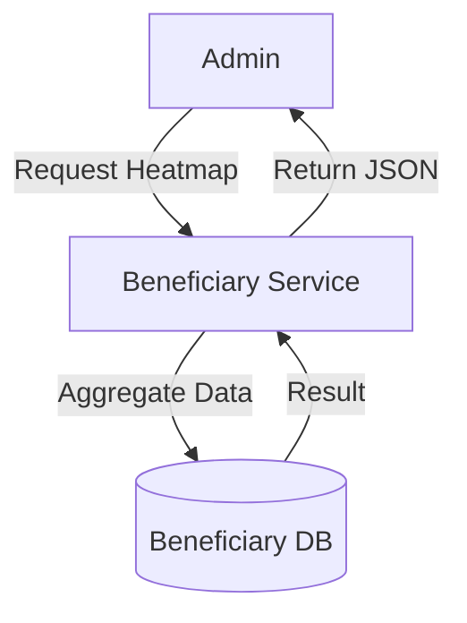

# Module 2: Beneficiary

## 1. Module Overview
Manages beneficiary profiles, KYC, and **Analytics**. Provides data for community heatmaps and demographic analysis.

## 2. Inputs & Outputs
- **Inputs**: Profile data, Certificates.
- **Outputs**: Verified Profile, **Heatmap Data**, Stats.

## 3. Tables Used
- `beneficiary_profiles`
- `users`

## 4. Detailed API List
| Method | Endpoint | Description | Request Body | Response Body |
| :--- | :--- | :--- | :--- | :--- |
| POST | `/beneficiaries` | Create profile | `CreateProfileRequest` | `ProfileResponse` |
| GET | `/beneficiaries/me` | Get my profile | - | `ProfileResponse` |
| PUT | `/beneficiaries/me` | Update profile | `UpdateProfileRequest` | `ProfileResponse` |
| POST | `/beneficiaries/upload-certificate` | Upload cert | `MultipartFile` | `UploadResponse` |
| GET | `/beneficiaries/certificate/download` | Download cert | - | `FileResource` |
| GET | `/beneficiaries` | Search | - | `ProfileListResponse` |
| GET | `/beneficiaries/{id}` | Get specific | - | `ProfileResponse` |
| PUT | `/beneficiaries/{id}/verify` | Verify | `VerifyRequest` | `ProfileResponse` |
| **GET** | `/analytics/heatmap/state-wise` | State heatmap | - | `HeatmapResponse` |
| **GET** | `/analytics/heatmap/district-wise` | District heatmap | - | `HeatmapResponse` |
| **GET** | `/analytics/heatmap/clusters` | Risk clusters | - | `ClusterResponse` |
| **GET** | `/beneficiaries/stats/demographics` | Demographics | - | `StatsResponse` |

## 5. DTOs
### HeatmapResponse
```json
{
  "region": "Uttar Pradesh",
  "riskScore": 75.2,
  "beneficiaryCount": 5000,
  "colorCode": "RED"
}
```

## 6. Entities
### BeneficiaryProfile
- `profileId`: Long (PK)
- `verifiedAnnualIncome`: BigDecimal
- `isProfileVerified`: Boolean

## 7. Validation Rules
- Heatmap data is cached for 24 hours.
- Only Officers/Admins can access analytics.

## 8. Business Rules
- **Heatmap Logic**: Red = High Risk (Low Score), Green = Low Risk (High Score).
- **Cluster Analysis**: Groups beneficiaries by pincode to find "credit-starved" areas.

## 9. Data Flow Diagram


## 10. Integration
- **Scoring Engine**: Uses profile data.
- **Frontend**: Renders Leaflet.js maps using Heatmap APIs.
