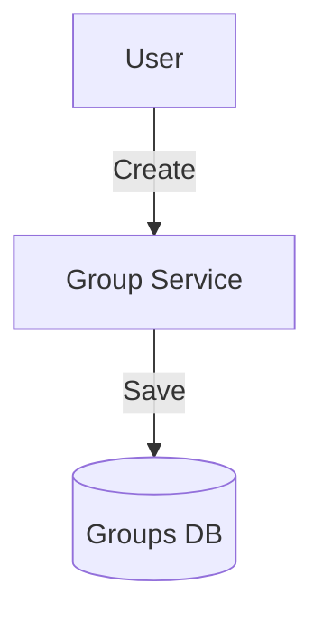

# Module 3: Group Lending

## 1. Module Overview
Facilitates Joint Liability Groups (JLGs). Manages group formation, membership, and leadership.

## 2. Inputs & Outputs
- **Inputs**: Group details, Join requests.
- **Outputs**: Group Status, Member List.

## 3. Tables Used
- `borrower_groups`
- `group_members`

## 4. Detailed API List
| Method | Endpoint | Description | Request Body | Response Body |
| :--- | :--- | :--- | :--- | :--- |
| POST | `/groups` | Create group | `CreateGroupRequest` | `GroupResponse` |
| GET | `/groups` | List groups | - | `GroupListResponse` |
| GET | `/groups/my-groups` | My groups | - | `GroupListResponse` |
| GET | `/groups/{id}` | Details | - | `GroupResponse` |
| PUT | `/groups/{id}` | Update | `UpdateGroupRequest` | `GroupResponse` |
| DELETE | `/groups/{id}` | Disband | - | `StatusResponse` |
| POST | `/groups/{id}/join` | Join | - | `MemberResponse` |
| POST | `/groups/{id}/leave` | Leave | - | `StatusResponse` |
| GET | `/groups/{id}/members` | Members | - | `MemberListResponse` |
| PUT | `/groups/{id}/members/{userId}/approve` | Approve | - | `MemberResponse` |
| DELETE | `/groups/{id}/members/{userId}` | Remove | - | `StatusResponse` |

## 5. DTOs
### CreateGroupRequest
```json
{
  "groupName": "Mahila Shakti",
  "projectDescription": "Dairy",
  "formationDate": "2023-10-01"
}
```

## 6. Entities
### BorrowerGroup
- `groupId`: Long (PK)
- `groupScore`: BigDecimal

## 7. Validation Rules
- Group name unique.
- Max 10 members.

## 8. Business Rules
- **JLG Logic**: All members are jointly liable (enforced in Loan Module).
- Leader must approve all members.

## 9. Data Flow Diagram


## 10. Integration
- **Loan Applications**: Group loans.
