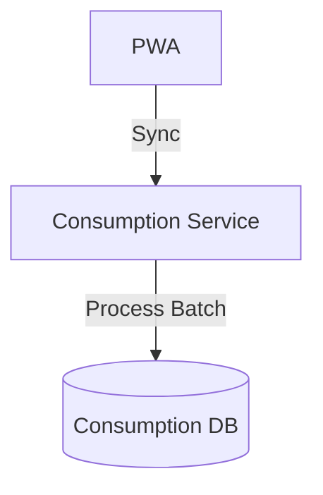

# Module 4: Consumption

## 1. Module Overview
Handles consumption data ingestion, including **Offline Sync** for rural areas.

## 2. Inputs & Outputs
- **Inputs**: Bills, Offline Batches.
- **Outputs**: Verified Data.

## 3. Tables Used
- `consumption_entries`

## 4. Detailed API List
| Method | Endpoint | Description | Request Body | Response Body |
| :--- | :--- | :--- | :--- | :--- |
| POST | `/consumption/upload` | Upload | `MultipartFile` | `UploadResponse` |
| GET | `/consumption` | List | - | `EntryListResponse` |
| GET | `/consumption/{id}` | Details | - | `EntryResponse` |
| DELETE | `/consumption/{id}` | Delete | - | `StatusResponse` |
| GET | `/consumption/summary` | Stats | - | `StatsResponse` |
| PUT | `/consumption/{id}/verify` | Verify | `VerifyRequest` | `EntryResponse` |
| GET | `/consumption/admin/search` | Search | - | `EntryListResponse` |
| **POST** | `/sync/offline-data` | Batch Sync | `OfflineBatchRequest` | `SyncResponse` |

## 5. DTOs
### OfflineBatchRequest
```json
{
  "entries": [
    { "date": "2023-01-01", "amount": 500, "source": "MOBILE" },
    { "date": "2023-02-01", "amount": 600, "source": "MOBILE" }
  ]
}
```

## 6. Entities
### ConsumptionEntry
- `entryId`: Long (PK)
- `isImputed`: Boolean

## 7. Validation Rules
- Offline data must not duplicate existing entries.

## 8. Business Rules
- **Offline Sync**: Accepts JSON payload from PWA local storage.
- **Verification**: High-value bills (> ₹5000) require manual check.

## 9. Data Flow Diagram


## 10. Integration
- **Fraud**: Checks for duplicates in batch.
