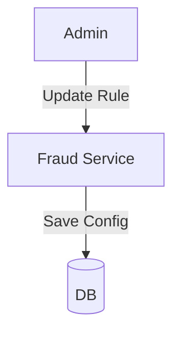

# Module 5: Fraud

## 1. Module Overview
Detects fraud and manages blacklists. Allows configuration of **Fraud Rules**.

## 2. Inputs & Outputs
- **Inputs**: Data streams, Manual checks.
- **Outputs**: Alerts, Blacklist Status.

## 3. Tables Used
- `fraud_alerts`
- `users`

## 4. Detailed API List
| Method | Endpoint | Description | Request Body | Response Body |
| :--- | :--- | :--- | :--- | :--- |
| GET | `/fraud/alerts` | List alerts | - | `AlertListResponse` |
| GET | `/fraud/alerts/{id}` | Details | - | `AlertResponse` |
| PUT | `/fraud/alerts/{id}/resolve` | Resolve | `ResolveRequest` | `AlertResponse` |
| POST | `/fraud/check-user/{userId}` | Manual check | - | `CheckResponse` |
| POST | `/fraud/blacklist/{userId}` | Blacklist | `BlacklistRequest` | `StatusResponse` |
| GET | `/fraud/blacklist` | List blacklisted | - | `UserListResponse` |
| **GET** | `/fraud/rules` | List rules | - | `RuleListResponse` |
| **PUT** | `/fraud/rules/{id}` | Update rule | `RuleUpdateRequest` | `RuleResponse` |

## 5. DTOs
### RuleUpdateRequest
```json
{
  "threshold": 300.0,
  "description": "Spike > 300% triggers alert"
}
```

## 6. Entities
### FraudAlert
- `alertId`: Long (PK)
- `severity`: Enum

## 7. Validation Rules
- Rules can only be updated by Admin.

## 8. Business Rules
- **Dynamic Rules**: Thresholds are configurable via API, not hardcoded.

## 9. Data Flow Diagram


## 10. Integration
- **All Modules**: Check blacklist before action.
