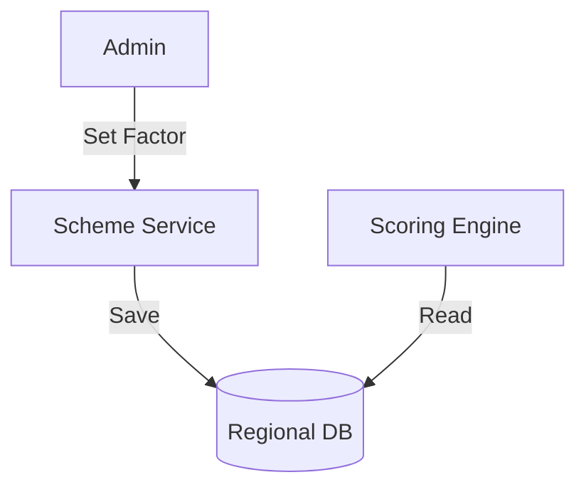

# Module 6: Loan Schemes & Regional

## 1. Module Overview
Manages loan products and **Regional Cost Parameters**.

## 2. Inputs & Outputs
- **Inputs**: Scheme Config, Regional Factors.
- **Outputs**: Eligible Schemes.

## 3. Tables Used
- `loan_schemes`
- `regional_parameters`

## 4. Detailed API List
| Method | Endpoint | Description | Request Body | Response Body |
| :--- | :--- | :--- | :--- | :--- |
| POST | `/schemes` | Create | `SchemeRequest` | `SchemeResponse` |
| GET | `/schemes` | List | - | `SchemeListResponse` |
| GET | `/schemes/{id}` | Details | - | `SchemeResponse` |
| PUT | `/schemes/{id}` | Update | `SchemeRequest` | `SchemeResponse` |
| DELETE | `/schemes/{id}` | Delete | - | `StatusResponse` |
| PUT | `/schemes/{id}/toggle` | Toggle | - | `SchemeResponse` |
| **GET** | `/admin/regional-parameters` | List params | - | `RegionListResponse` |
| **POST** | `/admin/regional-parameters` | Add param | `RegionRequest` | `RegionResponse` |
| **PUT** | `/admin/regional-parameters/{id}` | Update | `RegionRequest` | `RegionResponse` |

## 5. DTOs
### RegionRequest
```json
{
  "state": "Gujarat",
  "regionType": "RURAL",
  "costAdjustmentFactor": 1.10
}
```

## 6. Entities
### RegionalParameter
- `regionId`: Integer (PK)
- `costAdjustmentFactor`: BigDecimal

## 7. Validation Rules
- Factor must be > 0.

## 8. Business Rules
- **Regional Adjustment**: `Adjusted Income = Raw Income * Factor`.
- Used to normalize income across different economic zones.

## 9. Data Flow Diagram


## 10. Integration
- **Scoring Engine**: Consumes regional parameters.
