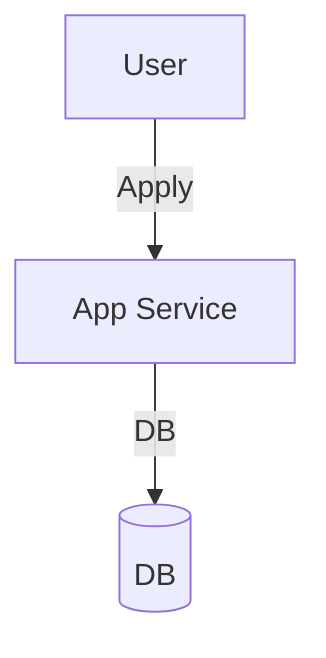

# Module 7: Loan Applications

## 1. Module Overview
Manages loan application lifecycle.

## 2. Inputs & Outputs
- **Inputs**: Application Data.
- **Outputs**: Status, Sanction.

## 3. Tables Used
- `loan_applications`

## 4. Detailed API List
| Method | Endpoint | Description | Request Body | Response Body |
| :--- | :--- | :--- | :--- | :--- |
| POST | `/applications` | Create | `ApplicationRequest` | `ApplicationResponse` |
| GET | `/applications` | List | - | `ApplicationListResponse` |
| GET | `/applications/{id}` | Details | - | `ApplicationResponse` |
| PUT | `/applications/{id}` | Update | `ApplicationRequest` | `ApplicationResponse` |
| POST | `/applications/{id}/submit` | Submit | - | `StatusResponse` |
| POST | `/applications/{id}/withdraw` | Withdraw | - | `StatusResponse` |
| GET | `/applications/officer/pending` | Pending | - | `ApplicationListResponse` |
| PUT | `/applications/{id}/review` | Review | `ReviewRequest` | `StatusResponse` |
| POST | `/applications/{id}/sanction` | Sanction | `SanctionRequest` | `StatusResponse` |
| GET | `/applications/{id}/timeline` | Timeline | - | `TimelineResponse` |

## 5. DTOs
### SanctionRequest
```json
{
  "amount": 50000,
  "interestRate": 12.0
}
```

## 6. Entities
### LoanApplication
- `applicationId`: Long (PK)
- `status`: Enum

## 7. Validation Rules
- Cannot withdraw sanctioned application.

## 8. Business Rules
- **Timeline**: Every status change is logged with timestamp.

## 9. Data Flow Diagram


## 10. Integration
- **Scoring**: Triggered on Submit.
