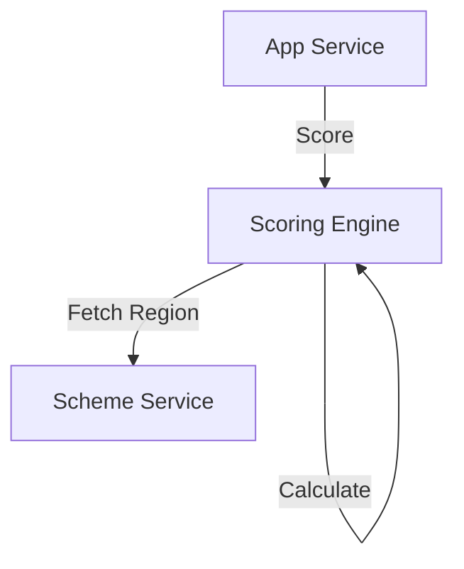

# Module 8: Scoring Engine

## 1. Module Overview
Calculates credit scores using ML and Regional Parameters.

## 2. Inputs & Outputs
- **Inputs**: Data, Models.
- **Outputs**: Score, Risk Band.

## 3. Tables Used
- `credit_assessments`
- `ml_models`

## 4. Detailed API List
| Method | Endpoint | Description | Request Body | Response Body |
| :--- | :--- | :--- | :--- | :--- |
| POST | `/scoring/assess/{applicationId}` | Assess | - | `AssessmentResponse` |
| GET | `/scoring/assessments/{applicationId}` | Get | - | `AssessmentResponse` |
| GET | `/scoring/models` | List | - | `ModelListResponse` |
| POST | `/scoring/models` | Add | `ModelRequest` | `ModelResponse` |
| PUT | `/scoring/models/{id}/activate` | Activate | - | `StatusResponse` |
| POST | `/scoring/simulate` | Simulate | `SimulateRequest` | `AssessmentResponse` |

## 5. DTOs
### SimulateRequest
```json
{
  "income": 20000,
  "region": "RURAL"
}
```

## 6. Entities
### CreditAssessment
- `assessmentId`: Long (PK)
- `compositeScore`: BigDecimal

## 7. Validation Rules
- Simulation does not save to DB.

## 8. Business Rules
- **Regional Logic**: Applies factor from Module 6.

## 9. Data Flow Diagram


## 10. Integration
- **Module 6**: Regional Params.
