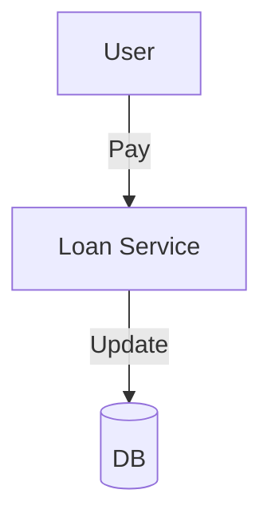

# Module 9: Loans & Repayments

## 1. Module Overview
Manages active loans and repayments.

## 2. Inputs & Outputs
- **Inputs**: Payments.
- **Outputs**: Loan Status.

## 3. Tables Used
- `loans`
- `repayments`

## 4. Detailed API List
| Method | Endpoint | Description | Request Body | Response Body |
| :--- | :--- | :--- | :--- | :--- |
| GET | `/loans` | List | - | `LoanListResponse` |
| GET | `/loans/{id}` | Details | - | `LoanResponse` |
| GET | `/loans/admin/search` | Search | - | `LoanListResponse` |
| GET | `/loans/{id}/schedule` | Schedule | - | `RepaymentListResponse` |
| GET | `/loans/{id}/transactions` | History | - | `TransactionListResponse` |
| POST | `/loans/{id}/repay` | Repay | `PaymentRequest` | `PaymentResponse` |
| POST | `/loans/{id}/foreclose` | Foreclose | - | `StatusResponse` |
| POST | `/loans/{id}/waive-off` | Waive | - | `StatusResponse` |

## 5. DTOs
### PaymentRequest
```json
{
  "amount": 1000,
  "mode": "UPI"
}
```

## 6. Entities
### Loan
- `loanId`: Long (PK)
- `outstandingPrincipal`: BigDecimal

## 7. Validation Rules
- Waive-off only by Admin.

## 8. Business Rules
- **Foreclosure**: Zeroes out outstanding.

## 9. Data Flow Diagram


## 10. Integration
- **Audit**: Logs waivers.
