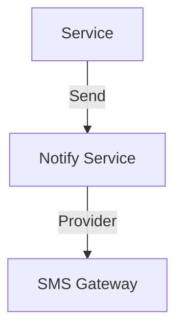

# Module 10: Notifications

## 1. Module Overview
Centralized notifications.

## 2. Inputs & Outputs
- **Inputs**: Events.
- **Outputs**: Messages.

## 3. Tables Used
- `notifications`

## 4. Detailed API List
| Method | Endpoint | Description | Request Body | Response Body |
| :--- | :--- | :--- | :--- | :--- |
| GET | `/notifications` | List | - | `NotificationListResponse` |
| PUT | `/notifications/{id}/read` | Read | - | `StatusResponse` |
| PUT | `/notifications/read-all` | Read All | - | `StatusResponse` |
| POST | `/notifications/send` | Send | `SendRequest` | `SendResponse` |
| GET | `/notifications/templates` | Templates | - | `TemplateListResponse` |

## 5. DTOs
### SendRequest
```json
{
  "userId": 1,
  "template": "OTP"
}
```

## 6. Entities
### Notification
- `notificationId`: Long (PK)
- `isRead`: Boolean

## 7. Validation Rules
- Template must exist.

## 8. Business Rules
- **Batching**: High volume messages are batched.

## 9. Data Flow Diagram


## 10. Integration
- **All Modules**.
