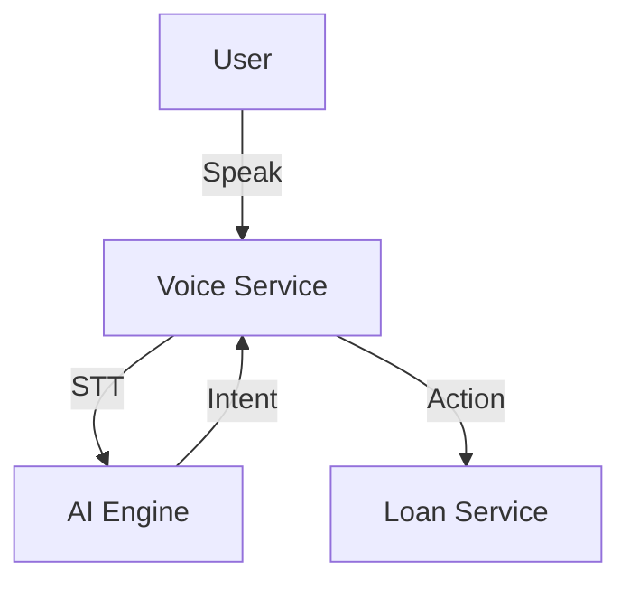

# Module 11: Voice

## 1. Module Overview
Voice interactions for accessibility.

## 2. Inputs & Outputs
- **Inputs**: Audio.
- **Outputs**: Actions.

## 3. Tables Used
- `voice_interactions`

## 4. Detailed API List
| Method | Endpoint | Description | Request Body | Response Body |
| :--- | :--- | :--- | :--- | :--- |
| POST | `/voice/command` | Command | `MultipartFile` | `VoiceResponse` |
| GET | `/voice/history` | History | - | `HistoryResponse` |
| GET | `/voice/supported-languages` | Languages | - | `LanguageListResponse` |

## 5. DTOs
### VoiceResponse
```json
{
  "intent": "CHECK_BALANCE",
  "text": "Balance batao"
}
```

## 6. Entities
### VoiceInteraction
- `interactionId`: Long (PK)
- `intentDetected`: String

## 7. Validation Rules
- Audio < 5MB.

## 8. Business Rules
- **Intents**: Mapped to specific service calls (e.g., `LoanService.getBalance()`).

## 9. Data Flow Diagram


## 10. Integration
- **Loan Module**.
