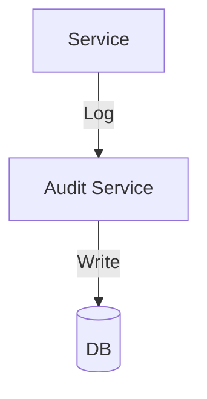

# Module 12: Audit & Logging

## 1. Module Overview
System-wide auditing.

## 2. Inputs & Outputs
- **Inputs**: Logs.
- **Outputs**: Reports.

## 3. Tables Used
- `audit_logs`

## 4. Detailed API List
| Method | Endpoint | Description | Request Body | Response Body |
| :--- | :--- | :--- | :--- | :--- |
| GET | `/audit/logs` | List | - | `LogListResponse` |
| GET | `/audit/logs/{id}` | Details | - | `LogResponse` |
| GET | `/audit/rescore-logs` | Rescores | - | `RescoreLogResponse` |
| POST | `/audit/export` | Export | `ExportRequest` | `FileResource` |

## 5. DTOs
### ExportRequest
```json
{
  "format": "CSV",
  "fromDate": "2023-01-01"
}
```

## 6. Entities
### AuditLog
- `logId`: Long (PK)
- `actionType`: String

## 7. Validation Rules
- Read-only.

## 8. Business Rules
- **Retention**: 7 Years.

## 9. Data Flow Diagram


## 10. Integration
- **All Modules**.
